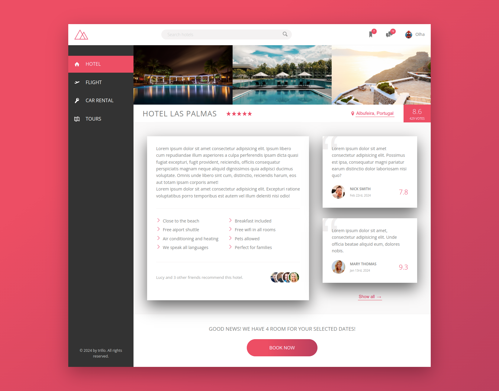
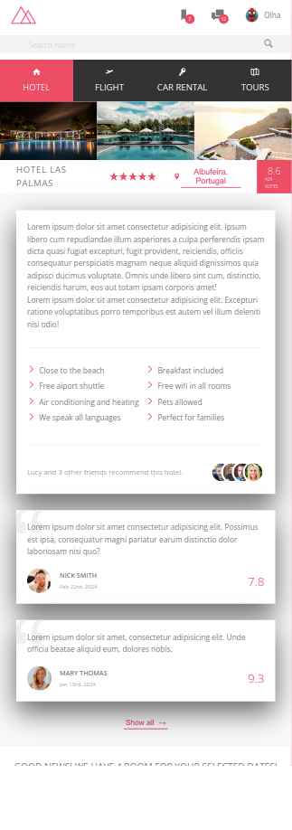

# Trillo Flexbox Practice

This is a fictional all-in-one booking app. UI only.

Deployed [here](https://olgaprikhodko.github.io/trillo-flexbox-practice/)

|             Desktop Screens              |                 Mobile Screens                  |
| :--------------------------------------: | :---------------------------------------------: |
|  |  |

### View Project Live

[https://olgaprikhodko.github.io/nexter/](https://olgaprikhodko.github.io/nexter/)

### Getting started

Clone or download project and then run:

```
npm install
npm start
```

### Used Technologies:

- **SCSS**: Styled with SCSS for more efficient, readable styling.
- **CSS Flexbox**: Extensive use of Flexbox for a modern, sophisticated layout.
- **SVG Icons**: Incorporates a sprite generated through [icomoon.app](icomoon.app) for crisp, scalable icons.
- **Responsive Design**: Utilizes a Desktop First strategy to ensure the site looks great on all devices.
- **BEM Methodology**: Adheres to BEM (Block Element Modifier) naming convention for CSS classes, enhancing readability and maintainability.

### Acknowledgments

Jonas Schmedtmann for the inspiring [Advanced CSS and Sass course](https://www.udemy.com/course/advanced-css-and-sass/).
